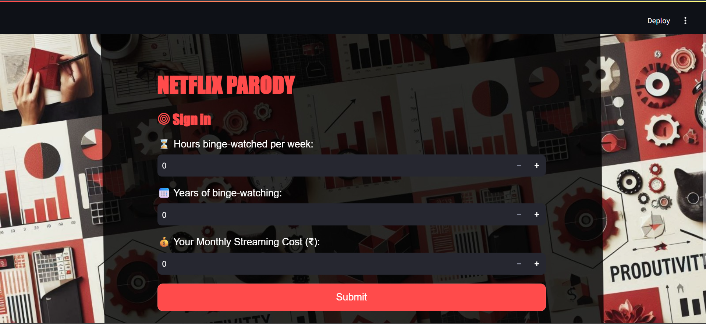
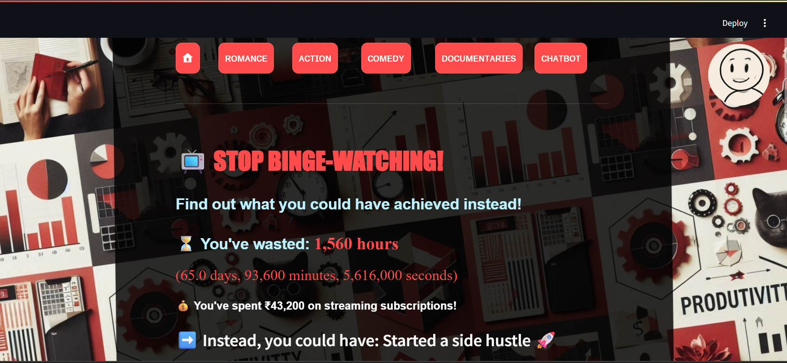

# NetflixParody 🎭

**NetflixParody** is an interactive Streamlit app designed to help users reflect on their binge-watching habits. By calculating time and money spent on streaming, the app offers playful alternatives, lifestyle suggestions, and even an AI-powered intervention chatbot to guide users towards better balance.

---

## Features

- 🔐 Simulated sign-in with binge-watching data input  
- 📊 Calculates total hours, days, and money spent on streaming  
- 📆 Shows what else you could have achieved with that time  
- 🎭 Genre-based alternatives (Romance, Action, Comedy, Documentaries)  
- 🤖 AI chatbot (Google Gemini) to assist in behavior reflection  
- 🌆 Custom background and animated profile GIF  
- 💡 Productivity tips, trending activity suggestions, and humorous copy  
- 🎉 Easter eggs based on user input

---

## Installation

1. Clone the repository:

   ```bash
   git clone https://github.com/yourusername/NetflixParody.git
   cd NetflixParody
   ```

2. Install dependencies:

   ```bash
   pip install -r requirements.txt
   ```

3. Set up your Gemini API key:

   Create a file at `.streamlit/secrets.toml` with the following contents:

   ```toml
   [genai]
   api_key = "your_gemini_api_key_here"
   ```

---

## Usage

To run the app:

```bash
streamlit run app.py
```

Replace `app.py` with the actual filename if it's different.

---

## Directory Structure

```
NetflixParody/
├── app.py                   # Main Streamlit script
├── login.jpg                # Background image
├── profilepic.gif           # Animated profile gif
├── gif.py                   # Script to generate gif
├── images/                  # Folder with GIF frame images
├── requirements.txt
└── .streamlit/
    └── secrets.toml         # API key (excluded from version control)
```

---

## Tech Stack

- **Python**
- **Streamlit** – interactive UI
- **Pillow** – image and GIF processing
- **Google Generative AI (Gemini)** – chatbot integration
- **HTML & CSS** – used within Streamlit markdown for styling

---

## UI Preview

### 🔐 Login Page


### 📊 Home Page


---
## License

This project is for educational and personal use. Modify and build upon it freely.
